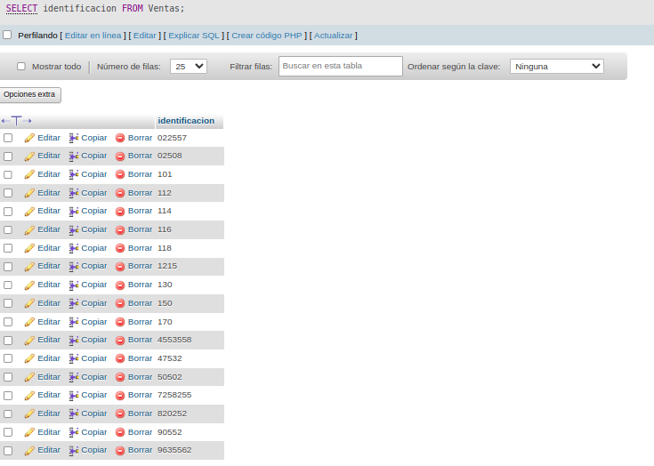
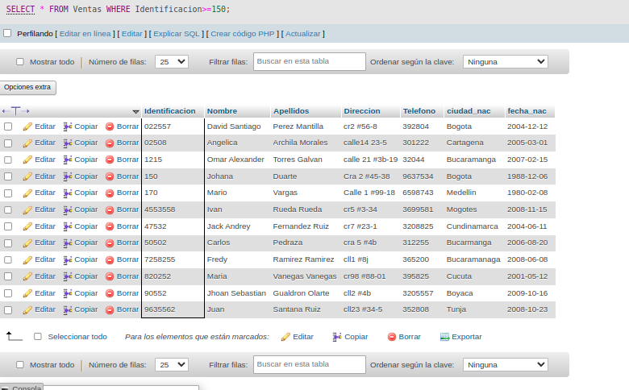
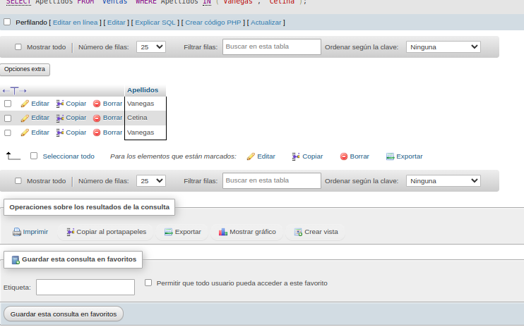
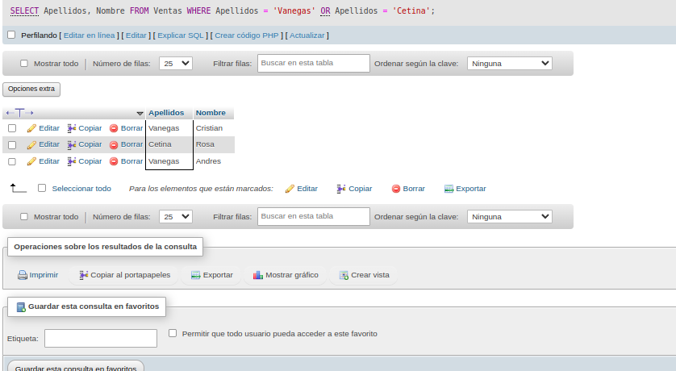
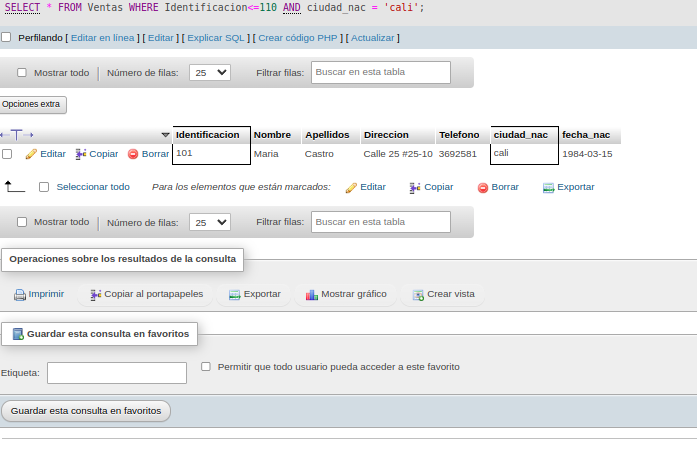
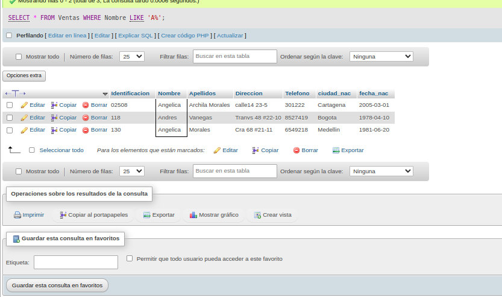
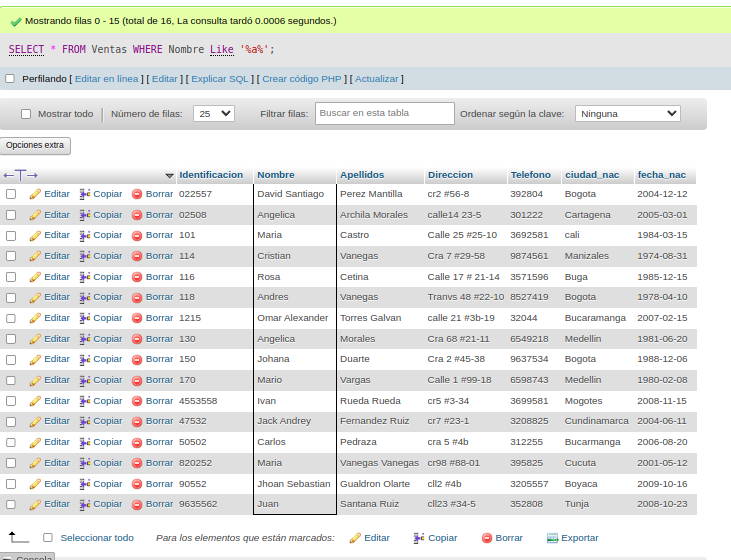
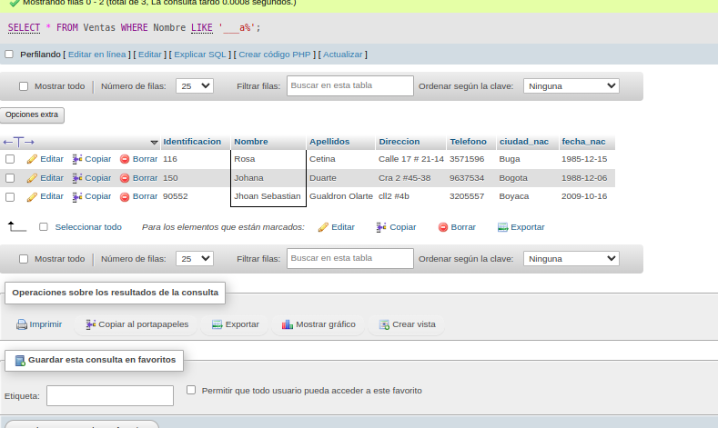
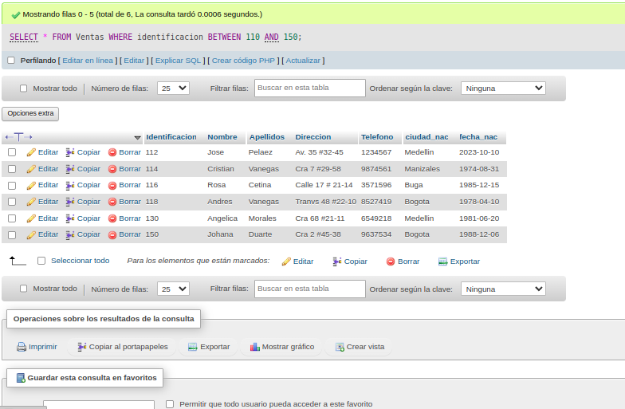

# consultas_1_SQL
# Introducción a las consultas en una base de datos en sql

## Base de datos: Ventas
## Tabla: Cliente

## Instruccion SELECT
- Permite seleccionar datos de una tabla.
- Su formato es: `SELECT campos_tabla FROM nombre_tabla``

### CONSULTA No. 1
1. Para visualizar toda la informacion que contiene la tabla Cliente se puede incluir con la instruccion SELECT el caracter **\*** o cada uno de los campos de la tabla.

- `SELECT * FROM Cliente`

- `SELECT identificacion, nombre, apellidos,direccion, telefono, ciudad_nac, fecha_nac FROM Cliente`

### Consulta No. 2

2. Para visualizar solamente la identificacion del Cliente: `SELECT identificacion FROM Cliente`

### Consulta No. 3

3. Si se desea obtener los registros cuya identificacion sea mayor o igual a 150, se debe utilizar la clausula `WHERE` que especifica las condiciones que deben reunir los registros que se van a seleccionar: `SELECT * FROM Cliente WHERE Idetificación>=150`

### Consulta No. 4

4. Se desea obtener los registros cuyos apellidos sean Vanegas o Cetina, se debe utilizar el operador `IN` que especifica los registros que se quieren visualizar de una tabla.

`SELECT apellido, FROM Cliente WHERE apellido IN('Vanegas', 'Cetina')`

o se puede utilizar el operador `OR`

`SELECT apellido,Nombre FROM Cliente WHERE apellido = 'Vanegas' OR apellido = 'Cetina'`

### Consulta No.5

5. Se desea obtener los registros cuya identificacion sea menor de 110 y la ciudad sea Cali, se debe utilizar el operador `AND`

`SELECT * FROM Cliente WHERE identificion<=110 AND ciudad = 'Cali'`

### Consulta No.6 

6. Si se desea obtener los registros cuyos nombres empiecen por la letra `A`, se debe utilizar el operador `LIKE` que utiliza los patrones `%` (todos) y `_` (caracter). 

`SELECT * FROM Ventas WHERE Nombre LIKE 'A%'`

### Consulta No.7 
7. Se desea obtener los registros cuyos nombres contengan la letra 'a'
`SELECT * FROM Ventas WHERE Nombre Like '%a%'`

### Consulta No.8
8. Se desea obtener los registros donde la cuarta letra del nomnre del cliente sea la letra 'a'

`SELECT * FROM Ventas WHERE Nombre LIKE '___a'`

### Consulta No.9
9. Si se desea obtener los registros cuya identificacion este entre el intervalo 110 y 150, se debe utilizar la clasula `BETWEEN`, que sirve para especificar un intervalo de valores 
`SELECT * FROM Ventas WHERE identificacion BETWEEN 110 AND 150`
